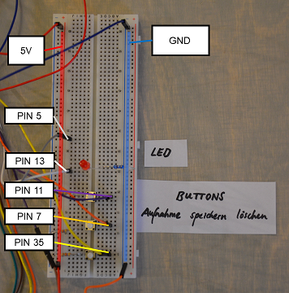
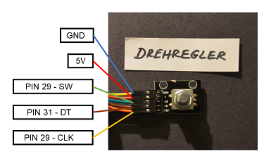
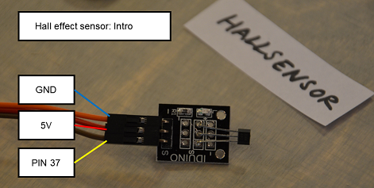

# KiezTalker
readme version: 2020-02-20

## A device for listening and recording its users personal stories

code by Michael Pluhatsch, Tanita Daniel, Felix Doege (Freie Universität Berlin)  
design by Cindy Peng, Antonia Nandori (Kunsthochschule Berlin-Weißensee)  


## Table of contents
- 1 [Project Description](#description)
	- 1.1 [Overview](#overview)
	- 1.2 [Design Concept](#concept)  
	- 1.3 [List of Parts](#parts)
	- 1.4 [Required Libraries](#libs)
- 2 [Installation](#install)  
- 3 [How To Use](#howto)  
- 4 [Appendix](#appendix)

<a name="description"/>  

###  1. Project Description 

<a name="overview"/>  

#### 1.1 Overview  

The project KiezTalk was created during a collaboration project of the the computer science department of the Freie Universität Berlin and the product design department of the Kunsthochschule Berlin-Weißensee, during the winter semester 2019/2020.  

The goal of the project was to develop devices for a smart city. Thus, the KiezTalker was born. Technically speaking, a Raspberry Pi is used to record audio files ('user stories'), these audio files are then analyzed using Speech-to-text. This text is then checked for keywords and categorized into one of five categories. The categories are: people, buildings, nature, events and a miscellaneous for audio files, which do not fit in any of these categories.  

The categorized audio files can be retrieved by users using a dial knob, which lets them choose the category. However, audio files are played randomly from these categories and users cannot choose the exact file they want to listen to.  

The KiezTalker consist of a stationary part, the 'pillar' and a detachable part the 'cone'. The dial knob is located inside the pillar and a Hall effect sensor, inside a rotating cover, is used to reset the dial knob once every full rotation, to reset the dial to the zeroing position.  

Several parts are installed inside of the cone. Firstly, a microphone and speakers. Secondly, three buttons, one for recording, one for saving a recorded audio file and one to delete a recording. A red LED is used to indicate, when a recording is active.

<a name="concept"/>  

#### 1.2 Design Concept  

KiezTalk  
Locals Become Locals  
  
**How can a place tell its own story?** You move to a new area and want to find out what's going on. You might have lived here for a while but still don't know much about the history and culture of your local area. Many others stay living in one place for a long time, and have accumulated a lot of stories to share and tell.
  
**Stories are told by residents, for residents**  
KiezTalk provides a way to redistribute this local knowledge, sharing random snippets that depict the profile of a local area. Stories are told by residents, for residents, helping locals become true locals. The KiezTalker encourages a spontaneous interaction. This initiative complements the offering of local museums, providing a means to record local history on a word-of-mouth basis.
  
**The neoanalog KiezTalker combines high-tech with classic analog gestures**  
Reminiscent of a paper cup and string telephone, the truncated cone serves as both the speaker and the microphone. Locals stumble upon the device, mounted in a bustling street location. As users hold the cone to their ear, they hear audio recorded by other locals. Turn the cone around and they can share their own story. KiezTalk is designed to be super-local, so users record stories about anything within in sight. 'Speech-to-text' software allows the audio to be automatically filtered according to key words and sorted into five categories. The device looks neutral, so KiezTalk easily blends into any local area: however the stories contained within are what make it individual.
  
**KiezTalk aims to strengthen the sense of community**  
It represents the true diversity of life in urban areas. Stories collected over time can be archived in local museums, preserving the recent history of a place. It's people who make the city what is, so it's only right the story of a place is told by those who know it best.

<a name="parts"/>  

#### 1.3 List of Parts

This section list the required hardware components to build a KiezTalker device.

- Raspberry Pi 3 or 4 (including accessories, like an SD-card, power supply etc.)
- 3x push button
- 2x hall effect sensor
- 1x colored LED (record light)
- 1x LED (for illumination, optional)
- 1x rotary encoder (knob)
- 1x microphone
- 1x speakers
- 1x generic USB-soundcard (to connect a microphone to the Raspi)

Miscellaneous:

- cables (a healthy variety of jumper wires with male and female connectors is recommended)
- breadboard (recommended for testing purposes)
- resistors
- capacitors
- magnets

<a name="libs"/>  

#### 1.4 Required Libraries

To install:
- RPi.GPIO (usually preinstalled)
- deepspeech
- numpy
- PyAudio
- pydub
- scipy

Additional libraries:
- shutil (for manipulating files)
- sys, os, time, datetime, random
- multiprocessing (adds multiprocessing, so you can still interact with the device, while DeepSpeech is working)

<a name="install"/>  

### 2. Installation

It is recommended to install the required libraries using `pip` inside a virtual environment. For more information please follow the official tutorial [Virtual Environments and Packages](https://docs.python.org/3/tutorial/venv.html).

The most important library used is Mozilla's DeepSpeech, a Speech-To-Text library. Which has both the advantages that it is Open Source and does not need a connection to the internet to work. As of now, there is only a pre-trained English model available.

Installation is straight forward.

##### Download the repository

`$ git clone https://github.com/Kiez-Schnitzel/Kiez-Prototype.git`

##### Install libraries
Using the requirements.txt:

`$ pip3 install -r requirements.txt `

or manually:


```
# RPi.gpio
$ pip3 install rpi.gpio

# deepspeech (including numpy)
$ pip3 install deepspeech

# scipy
$ pip3 install scipy

# PyAudio
$ pip3 install pyaudio

# pydub
$ pip3 install pydub
```

For further information, please refer to the libraries documentations.

##### Deepspeech model 

(Tested with version 0.6.1)

[Deepspeech repository](https://github.com/mozilla/DeepSpeech)

Download pre-trained English model and extract 
```
# Download
$ curl -LO https://github.com/mozilla/DeepSpeech/releases/download/v0.6.1/deepspeech-0.6.1-models.tar.gz 

# Extract
$ tar xvf deepspeech-0.6.1-models.tar.gz
```
Place the folder deepspeech-0.6.1-models in the main directory of this repository.

##### Hardware
The physical pin layout is used: `GPIO.setmode(GPIO.BOARD)`.
To see the GPIO pin layout refer to [www.pinout.xyz](https://pinout.xyz) or type `pinout` in a terminal window of your RaspberryPi.


- connect all the parts to their respective GPIO pins on your RaspberryPi ([see pictures](#pics)) 
- LEDs are connected to ground (GND) and a datapin
- buttons are connected to power (5V) and their respective datapins  

Start the KiezTalker software:
`$ python3 kieztalk.py`  .


<a name="pics"/>

  

  

  

  


*The standard audio device may need to be changed. For more information look [HERE](https://www.raspberrypi-spy.co.uk/2019/06/using-a-usb-audio-device-with-the-raspberry-pi/).*

<a name="howto"/>

### 3. How To Use  
In idle mode the cone is connected to the pillar. The Hall effect sensor inside the cone detects the magnet inside the pillar, when the cone is removed the magnetic field changes and the Intro audio file starts playing.  

After listening to the intro, it is up to the user, if he or she wants to listen or record an audio file. The dial knob is used to choose a category and then an audio file is played from this category. An additional postion on the dial knob is used to play an introductory message on how to record an audio file.  

The buttons for recording, saving and deleting are located inside the cone. The save and delete buttons have no functions, only after a recording has been made they are active and can be used to make a choice.  

When the user is finished using the device, he or she simply reattaches the cone to the pillar, the device stays in idle mode and waits for user input. 

<a name="appendix"/>

### Appendix
- License:  
Published under the Creative Commons Attribution 4.0 International License, however use for non-commercial purposes is recommended.
- Weblinks:  
[FU Berlin: Human-Centered Computing News](https://www.mi.fu-berlin.de/en/inf/groups/hcc/news/entcit-exhibition-opening.html)  
https://interaktion-produktdesign-khb.de  
https://www.citylab-berlin.org/events/entitycity/  

Video explaining functions:  
https://youtu.be/RhopoLg86mg

Concept Video:  
https://vimeo.com/393039435

